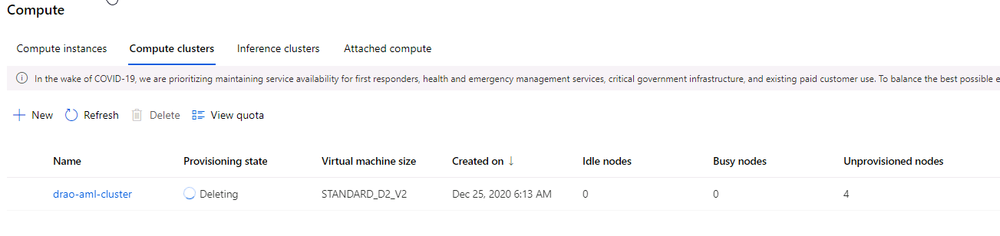

# Optimizing an ML Pipeline in Azure

## Overview
This project is part of the Udacity Azure ML Nanodegree.
In this project, we build and optimize an Azure ML pipeline using the Python SDK and a provided Scikit-learn model.
This model is then compared to an Azure AutoML run.

## Summary
The dataset contains data about marketing compaigns of bank. The label indicates whether the customer subcribed after the campaign. The goal is to build a classification model that predicts if the client will subscribe or not.  The data contains demographic information of the client such as age, job, marital status and education along with finacial information such as housing, loan. Each record for the customer contains information related to participation in previous campaigns, when he was last contacted ..etc.

The best performing model is the model generated by AutoML with an accuracy of 0.9168 and AUC of 0.94867. Although the model traing using hyperdrive is close with an accuracy of 0.9123 and an AUC of 0.9214.

## Scikit-learn Pipeline
AzureML supports hyperparameter tunig using hyperdrive package. Using hyperdrive, the parameter search space space can be defined using randon, grid or bayesian sampling. In the experiement, LogisticRegression classification was used. The training script loads the data, cleans that data, and runs LogisticRegression using the parameters supplied to the script and logs the metrics. The hyperdrive samples the paramters and calls the training script using a set of parameters at a time. Hyperdrive compares the metrics, and ranks the experiment runs based the specific metric. In this experiment, Accuracy was used to rank the runs.

In this experiment, RandomSampling was used to sample max_iter and C paramters. max_iter uses discrete list [500, 1000, 5000] and C uses discrete list [100, 10, 5, 1.0, 2]. The Random Sampling selects combination max_iter and C. Random Sampling supports early termination of low-performance runs. 

the hyperdrive support early termination using a policy, which improves the performance. In this experiement, BanditPolicy was used to terminate runs where the primary metric is not within the specified slack factor/slack amount compared to best performing run.

## AutoML
Azure Maching Learning support automatic training and comparison of maching learning models using AutoML. AutoML preprocessed the data, trains different models and ranks the models based on user selected metric.  In this experiment, AutoML identified VotingEnsemble.

To verify whether autoML preprocessed the data, I have preprocessed the data and ran another AutoML run using the processed data. Both AutoML runs gave similar results, which proves the point that AutoML checks the data and cleans and preprocesses the data.

## Pipeline comparison
Both Hyperdrive pipeline and AutoML pipeline provided similar results. Hyperdrive pipeline provided an accuracy of 0.9123 and an AUC of 0.9214. The AutoML pipeline provided an accuracy of 0.9168 and AUC of 0.94867.

## Future work
The AutoML dataguard feature indicates that the data is imbalanced. the smallest class has 3692 rows where as the dataset contains 32950. Using undersampling or oversampling can improve the performance. Due imbalance in data, accuracy may not be right metric. 
AutoML can identify some of the best performing machine learning models quickly, which then can be used to finetune using processed data and searching hyperparamters using those models.

## Proof of cluster clean up

