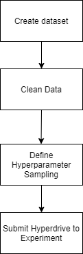
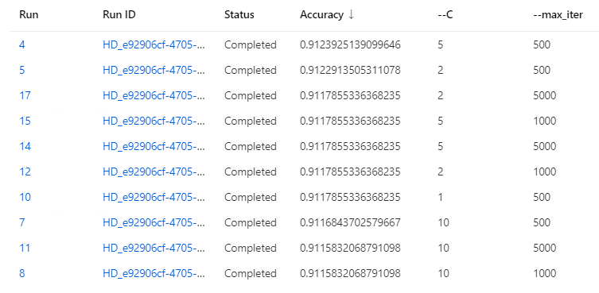
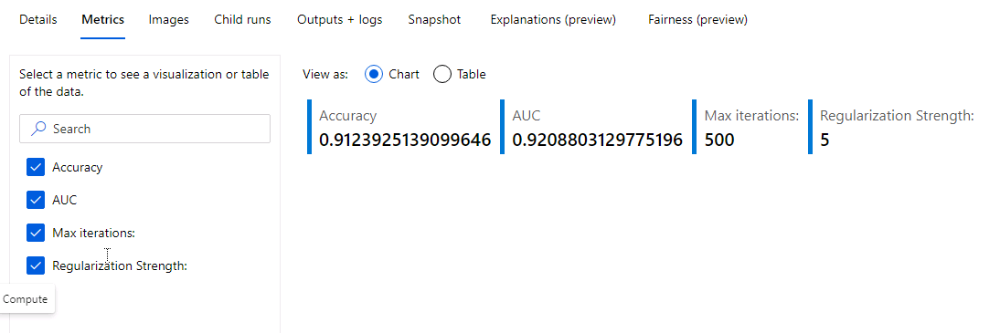
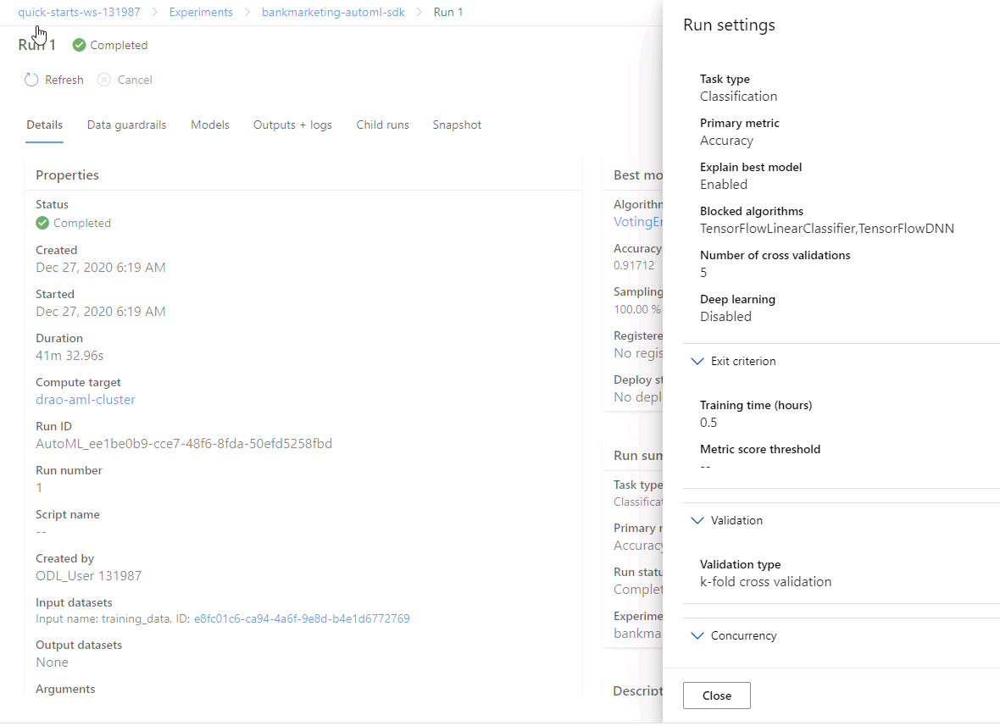
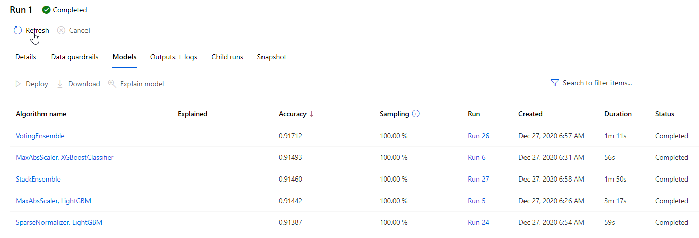
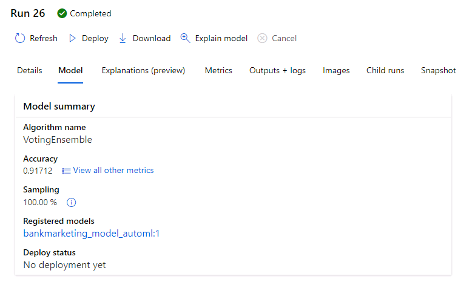
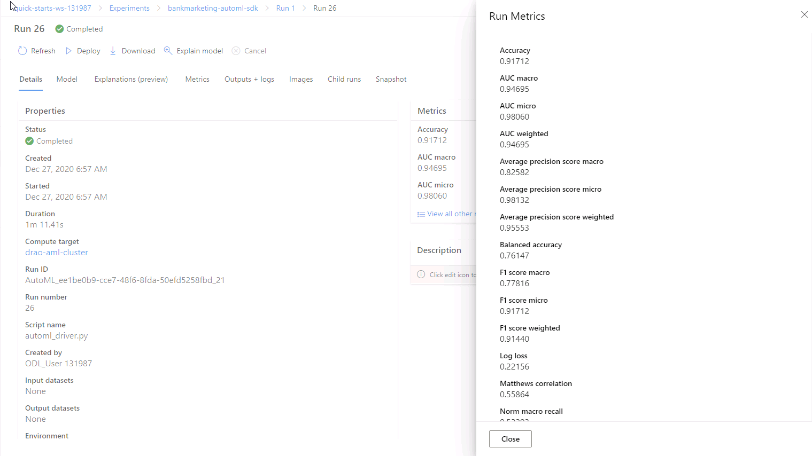

# Optimizing an ML Pipeline in Azure

## Overview
This project is part of the Udacity Azure ML Nanodegree.
In this project, we build and optimize an Azure ML pipeline using the Python SDK and a provided Scikit-learn model.
This model is then compared to an Azure AutoML run.

## Summary
The dataset contains data about marketing compaigns of bank. The label indicates whether the customer subcribed after the campaign. The goal is to build a classification model that predicts if the client will subscribe or not.  The data contains demographic information of the client such as age, job, marital status and education along with finacial information such as housing, loan. Each record for the customer contains information related to participation in previous campaigns, when he was last contacted ..etc.

The best performing model is the model generated by AutoML with an accuracy of 0.9168 and AUC of 0.94867. Although the model traing using hyperdrive is close with an accuracy of 0.9123 and an AUC of 0.9214.

## Scikit-learn Pipeline
AzureML supports hyperparameter tunig using hyperdrive package. Using hyperdrive, the parameter search space space can be defined using randon, grid or bayesian sampling. In the experiement, LogisticRegression classification was used. The training script loads the data, cleans that data, and runs LogisticRegression using the parameters supplied to the script and logs the metrics. The hyperdrive samples the paramters and calls the training script using a set of parameters at a time. Hyperdrive compares the metrics, and ranks the experiment runs based the specific metric. In this experiment, Accuracy was used to rank the runs.

In this experiment, RandomSampling was used to sample max_iter and C paramters. max_iter is the maximum number of iterations for the learning algorith to converge. In thix experiment, I have used discrete list values [500, 1000, 5000] for max_iter. C is the inverse of regularization strength. In this experiment, i have used discrete list values [100, 10, 5, 1.0, 2] for C. The Random Sampling selects combination max_iter and C. Random Sampling supports early termination of low-performance runs. The high level steps in hyperdrive pipeline are shown in the following diagram

The hyperdrive support early termination using a policy, which improves the performance. In this experiement, BanditPolicy was used to terminate runs where the primary metric is not within the specified slack factor/slack amount compared to best performing run.

The following picture shows the results of hyperdrive experiment, shows the runs with hyperparameters and results. The best performing model uses a value of 5 for C and 500 for max_iter

The best run model provides an accuracy of 0.9123. the following picture shows the metrics of the best performing model
 

## AutoML
Azure Maching Learning support automatic training and comparison of maching learning models using AutoML. To Run AutoML, an AutoMLConfig object needs to be created with paramteres such as dataset, training cluster, machine learning task, target column and metric to evaluate the algorithm. The following code snippet shows the parameters of the automl configutation.
 
The AutoMLconfig object is then submitted to an experiment, which runs AutoML on the specified data. The following picture shows the run settings of the AutoML run.

AutoML preprocessed the data, trains different models and ranks the models based on user selected metric. The following picture shows top 5 algorithms that autoML ran and ranked the runs based on the metric.

 
In this experiment, AutoML identified VotingEnsemble. The following picture shows the run settings of voting ensemble algorithm.

A voting ensemble is an ensemble machine learning model that combines the predictions from multiple other models. The following picture shows metrics generated by voting ensemble.

The AutoML fitted model can be obtained using the get_output() method of the AutoML run object. The fitted model describes the steps used in the model, the data transformations applied and the hyperparameters used in the model. In this experiment, AutoML used votingclassifier with hyperparameters min_weight_fraction_leaf=0.0,n_estimators=10,n_jobs=1,oob_score=False,random_state=None,verbose=0,warm_start=False . The following screenshot shows fitted model properties.

To verify whether AutoML preprocessed the data, I have preprocessed the data and ran another AutoML run using the processed data. Both AutoML runs gave similar results, which proves the point that AutoML checks the data and cleans and preprocesses the data.

## Pipeline comparison
Hyperdrive uses a script, that trains the models and predicts the accuracy based on test data.The script can be modified to include different algorithms and hyperparameters. In this example, LogisticRgression has been used and hyperparameters specific to LogistricRegression are sampled. Hyperdrive uses these sampled parameters and runs the script to identify best hyperapameters. AutoML uses AutoMLConfig to specify parameters for AutoML run. AutoML chooses what algorithms to run and the hyperparameters it need to pass to the algorithms. We can exclude some algorithms if needed. The AutoML is more complex and it involves preprocessing the data, identifying training algorithms to use depending on the task and ranking the models based on the mteric. Hyperdrive is simple and it just uses different combinations of hyperparameters to run at a time.

Both Hyperdrive pipeline and AutoML pipeline provided similar results. Hyperdrive pipeline provided an accuracy of 0.9123 and an AUC of 0.9214. The AutoML pipeline provided an accuracy of 0.9168 and AUC of 0.94867.

## Future work
The AutoML dataguard feature indicates that the data is imbalanced. the smallest class has 3692 rows where as the dataset contains 32950. Using undersampling or oversampling can improve the performance. Due imbalance in data, accuracy may not be right metric. 
AutoML can identify some of the best performing machine learning models quickly, which then can be used to finetune using processed data and searching hyperparamters using those models.

## Proof of cluster clean up

